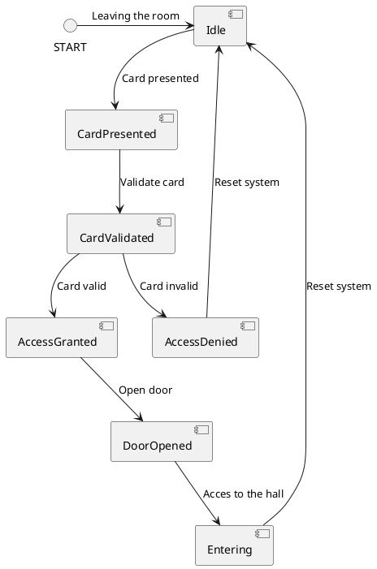
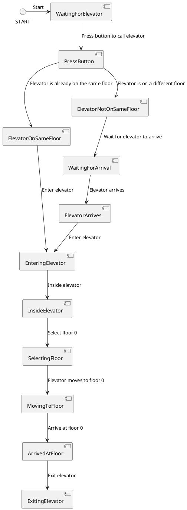

# State Diagram

*-First State Diagram of Getting Access to the Hall*

The system begins in an idle state, awaiting card presentation. Once the card is presented, it transitions to card validation. 
If the card is valid, access is granted, the door opens, and the person enters. If the card is invalid, access is denied, and the system resets to idle. 

---

*-Second State Diagram of Using the Elevator*

This state diagram models the process of a person using an elevator to travel to floor 0. 
Upon pressing the button, there’s a chance that the elevator is already on the same floor, allowing immediate entry. 
Otherwise, there’s a chance that the elevator is on a different floor, requiring the person to wait for its arrival. Once inside, the person selects floor 0, and the elevator moves to the destination. 

The process concludes when the elevator reaches floor 0 and the person exits.

