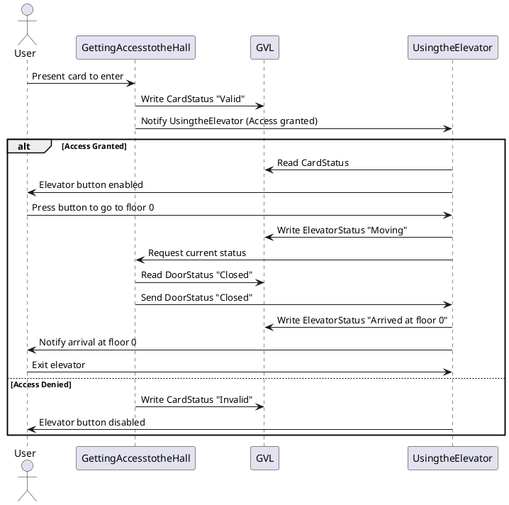
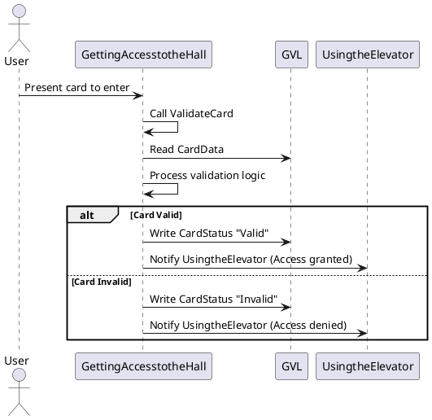

# Sequence Diagram

*-Sequence diagram depicting the communication between the tasks*

The sequence diagram illustrates the interaction between the User, "GettingAccesstotheHall", and "UsingtheElevator". The user presents a card, prompting "GettingAccesstotheHall" to validate access and notify "UsingtheElevator". 

After the user presses the elevator button, "UsingtheElevator" checks the door status with "GettingAccesstotheHall" and updates the elevator's status accordingly. 

Finally, the user is informed of their arrival at floor 0, completing the process.

---

*-Sequence diagram showing the calling of the function by the task*

In this sequence diagram, the User presents a card to "GettingAccesstotheHall", which calls the ValidateCard function to process the card information. 
Depending on the validation outcome, "GettingAccesstotheHall" updates the Global Variable List (GVL) with either "Valid" or "Invalid" status and notifies "UsingtheElevator" accordingly. 

This diagram highlights the modular design of the system, demonstrating how a specific function handles critical validation logic.

